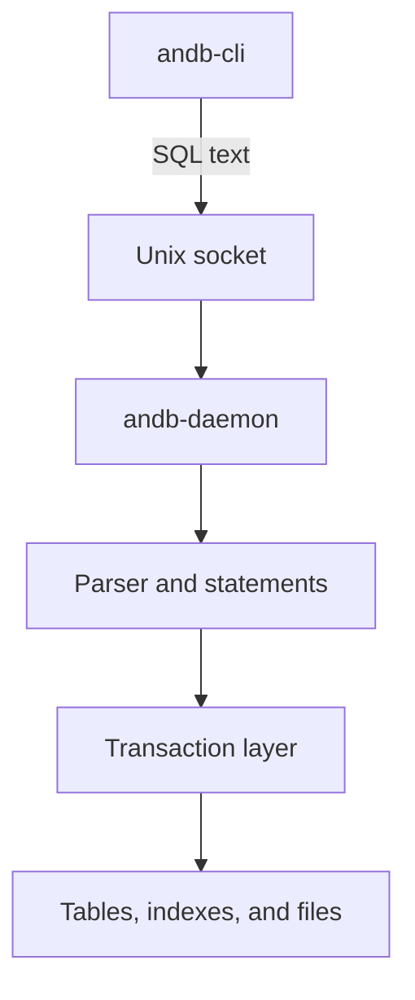
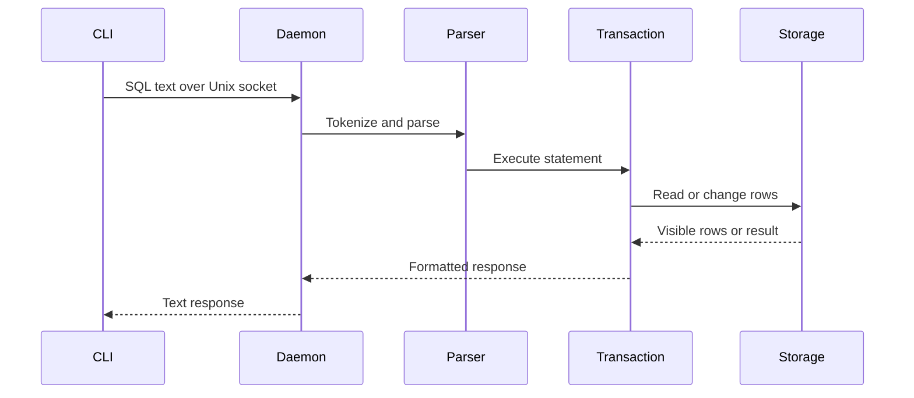
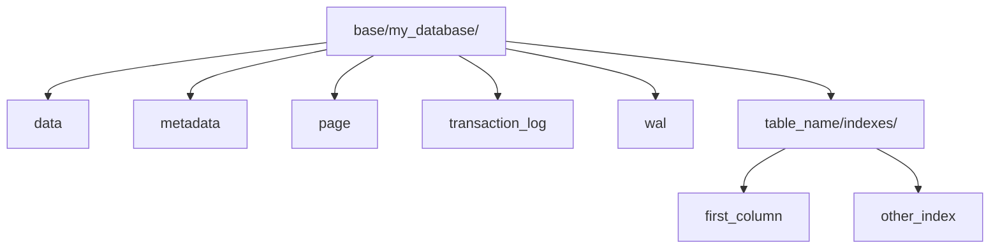
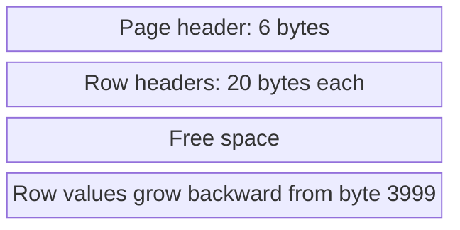
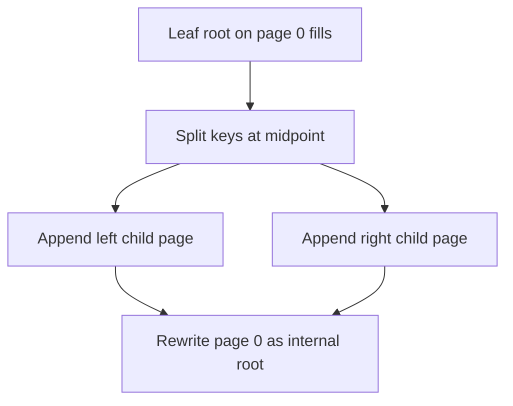
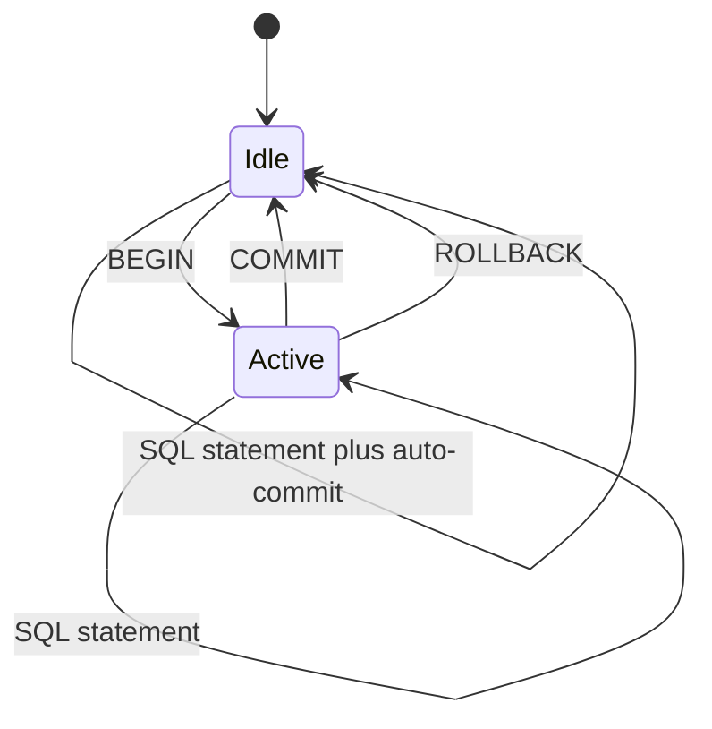
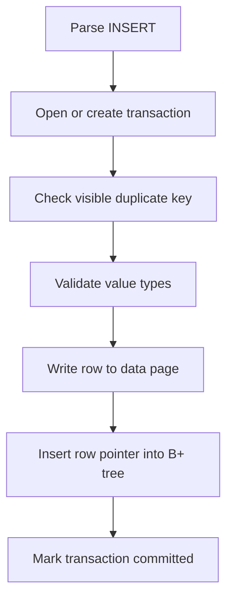
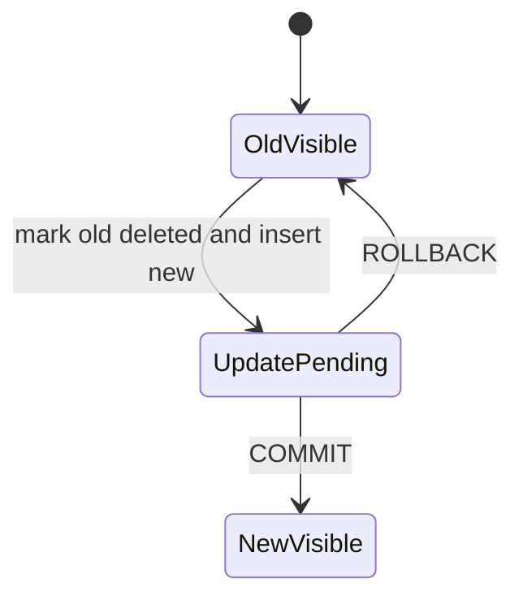
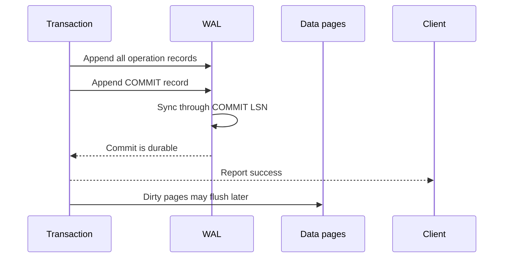
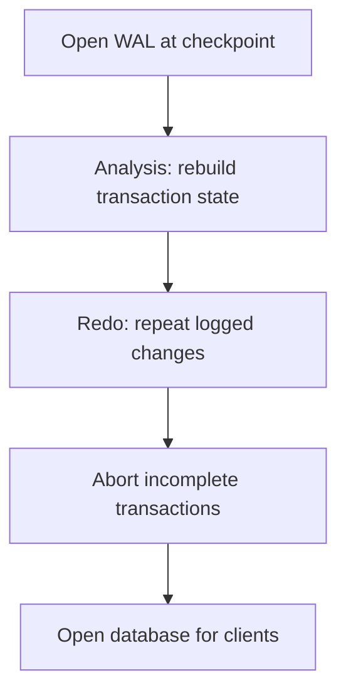

This is the technical companion to *Building ANDB: Learning How a Database Actually Works*.

The short blog explains why I built ANDB and what I learned. This document explains how the current code works. It follows a query from the CLI to the daemon, parser, transaction layer, B+ tree, row page, and disk. It also explains what ANDB does not yet guarantee.

ANDB is a learning database. Some parts work as planned. Some parts are prototypes. A few parts contain bugs that only become clear when the code is traced as one system. I will separate those cases throughout the document:

- **Implemented** means the current code has a complete path for the described case.
- **Partial** means the code has the main idea, but misses a required path or guarantee.
- **Designed** means the section explains the complete workflow that the surrounding data structures were built to support.

The source of truth for this document is the current [`main` branch](https://github.com/Anurag-Raut/ANDB).

## 1. Project scope

ANDB is a small relational database written in C++. It supports a focused SQL subset:

- `CREATE TABLE`
- `INSERT`
- `SELECT`
- `UPDATE`
- `DELETE`
- `BEGIN`
- `COMMIT`
- `ROLLBACK`

It also supports comparison expressions and simple `AND` and `OR` expressions.

The code has four main layers:

1. A command-line client sends text over a Unix domain socket.
2. A daemon accepts clients and runs one thread per connection.
3. A tokenizer, parser, and statement layer turn SQL into calls on a transaction.
4. A storage layer manages schemas, row pages, indexes, and transaction state.

ANDB does not have a query optimizer or buffer pool. It does not aim to match PostgreSQL or MySQL. Its value comes from exposing the parts that a database client hides. The later WAL section explains the full recovery design.

## 2. Architecture

### 2.1 The main process boundary

ANDB builds two executables:

- `andb-cli`
- `andb-daemon`

The CLI does not open database files. It connects to `/tmp/mydb.sock` and sends commands as text. The daemon owns query execution and file access.



This split gives ANDB a client-server shape without TCP. A Unix socket keeps all traffic on one machine. It also lets many CLI processes talk to one daemon.

### 2.2 Daemon startup

The daemon uses the common double-fork pattern:

1. It forks and lets the first parent exit.
2. It calls `setsid()` to create a new session.
3. It forks again.
4. It changes the file mode mask.
5. It changes the working directory to `/`.
6. It closes inherited file descriptors.

Before this happens, the global `BASE_DIRECTORY` value is built from the process working directory. That string remains valid after the daemon changes its working directory.

The daemon then removes an old socket path, creates the base directory, binds the socket, and starts listening. Its listen backlog is five.

Each accepted client gets a detached thread:

```cpp
std::thread(handle_client, client_socket).detach();
```

This is a thread-per-connection model. It is easy to follow, but it puts shared state and file access under pressure. The concurrency section covers those issues.

### 2.3 Connection and database lifetime

The first command is outside SQL:

```text
CONNECT <database_name>
```

The connection REPL creates a new `Database` object for that name. The constructor opens the database files and loads table metadata. It then creates an `Interpreter` for the connection.

The interpreter stays in a loop:

1. Read query text from the socket.
2. Tokenize it.
3. Parse one or more statements.
4. Create or reuse a transaction.
5. Execute each statement.
6. Write the result back to the socket.

The important point is that each connection creates its own `Database` object and its own file streams. Two clients connected to the same database can open the same files through different C++ stream objects.

### 2.4 Full query path

The full path looks like this:



There is no separate planner or executor tree. A parsed statement calls the transaction API. Expressions call range queries. The range query uses a B+ tree and then reads row pages.

### 2.5 Source layout

The project keeps the main code in these areas:

| Area | Main files | Role |
| --- | --- | --- |
| CLI | `cli/main.cpp` | Read terminal input and exchange socket messages |
| Daemon | `daemon/main.cpp`, `daemon/repl.cpp` | Run as a service, accept clients, and select a database |
| SQL | `daemon/parser/*` | Tokenize, parse, build statements, and execute expressions |
| Storage | `daemon/storage/*` | Manage databases, tables, pages, B+ trees, and transactions |
| Shared state | `daemon/globals.hpp` | Store page size, paths, transaction IDs, active transactions, and locks |
| Lock prototype | `daemon/utils/orderedLock.cpp` | Order update access through one condition variable |

The build files compile only `main.cpp` for each executable. The daemon source includes several `.cpp` files directly. This works like one large translation unit. It also hides module boundaries from the linker and makes separate testing harder.

## 3. Database and file layout

### 3.1 One directory per database

ANDB maps each database name to one directory under `base/`.

The current layout is important because it differs from the early design notes. Row data is not stored in one file per table. All tables in one database share the main data file and page map. Indexes provide the table-specific paths into that shared row storage.



The files have these roles:

| File | Purpose | Current status |
| --- | --- | --- |
| `data` | Store 4,000-byte row pages | Implemented |
| `page` | Track free space for each data page | Implemented, but incomplete for deletes |
| `metadata` | Store the next transaction ID and table schemas | Implemented |
| `transaction_log` | Store transaction ID and status records | Implemented |
| `wal` | Store ordered transaction records for durability and recovery | WAL workflow |
| Index file | Store one B+ tree as 4,000-byte pages | Implemented for primary index inserts and scans |

### 3.2 Opening a database

The `Database` constructor creates missing files, then opens them for input and output.

If the metadata file is empty, it writes the first transaction ID. If the file already has data, it reads the saved transaction ID and loads the table list.

The metadata file starts with an eight-byte native `uint64_t`. The code then writes a newline. Each later line contains:

```text
table_name type1,type2,... column1,column2,...
```

For example:

```text
users string,int,string id,age,name
```

On startup, ANDB reads each line and creates a `Table` object. It always treats the first column as the primary key. The metadata format does not store a primary-key position.

### 3.3 Table identity

A table has:

- a name
- a list of column names and types
- a primary key position, which defaults to zero
- a list of indexes
- pointers to the database-wide data and page-map streams

When ANDB creates a table, it creates a directory for that table and a primary index file named after the first column.

The row page itself does not store the table name. A table finds its rows through its index. This means one data page can hold rows from different tables. Each table decodes only the rows reached through its own index.

This is a valid basic design, but it creates a strong invariant:

> Every reachable row must have a correct index entry, and every index entry must point to a row encoded with that table's schema.

ANDB has no repair path if that invariant breaks.

### 3.4 Native binary format

ANDB writes integer and Boolean values in the host machine's native format. It does not define:

- byte order
- format version
- file magic number
- checksum
- compiler ABI
- migration rules

The metadata, transaction log, page map, row pages, and index pages all depend on native C++ sizes.

That makes the files suitable for a local learning project. It does not make them portable across compilers, architectures, or later structure changes.

## 4. Storage engine

### 4.1 Logical row format

ANDB accepts column values as strings. It checks each value against the declared type, then joins the values with commas:

```text
key1,20,5000
```

The supported type checks in the table layer are:

- `string`
- `int`
- `float`
- `bool`

The SQL parser cannot create every one of those types through its current keyword map. `INT`, `STRING`, and `BOOL` have parser paths. `FLOAT` does not have the same complete SQL path.

The comma-separated row format has no escape rule. A string containing a comma cannot be decoded safely. Quoting is also not stored as a formal part of the row format.

The storage engine treats the primary key as a string. Even an `INT` primary key uses string comparison in the B+ tree. That means numeric keys sort by text:

```text
"1", "10", "100", "2", "20"
```

This matters for range queries.

### 4.2 Page allocation

The `page` file stores one `PageMap` record per data page.

Each record contains:

| Field | Type | Bytes |
| --- | --- | ---: |
| Page number | `uint64_t` | 8 |
| Available space | `uint16_t` | 2 |
| Available block count | `uint16_t` | 2 |
| Total |  | 12 |

The record for data page `n` starts at:

```text
n * 12
```

For each insert, `writeData()` starts at page zero and scans the page-map records. It chooses the first page that appears to have enough free space. If no page qualifies, it appends a new data page.

This gives first-fit allocation with a linear scan:

```text
Insert allocation cost = O(number of data pages)
```

The design has no free-space tree, bucket list, or in-memory cache. As the file grows, each insert can read more page-map entries.

### 4.3 Data and index separation

ANDB stores row values in the shared `data` file. It stores search keys in an index file. A leaf index record points to:

```text
(data_page_number, block_number)
```

This is similar to a row identifier. It lets the index remain smaller than the row data. It also means an indexed scan has two steps:

1. Read an index leaf to get the row location.
2. Read the data page and decode the row.

ANDB has no buffer pool, so repeated row reads call `seekg()` and read a full 4,000-byte page each time.

### 4.4 Insert path

At the table layer, an insert follows this path:

1. Check that the value count matches the column count.
2. Search for a visible row with the same primary key.
3. Validate each string against its column type.
4. Join all column values with commas.
5. Find a data page with free space.
6. Write the row and its transaction fields.
7. Build a `Block` with the key, data page, and row slot.
8. Insert that block into every index.

The data write and index update form one logical transaction change. The WAL section explains how the write-ahead rule records that change before a dirty page can reach disk.

### 4.5 Delete path

A delete does not remove row bytes. It writes the deleting transaction ID into the row header.

The code contains an older physical compaction attempt, but that path is commented out. The page map does not gain free space after a delete. The B+ tree entry also remains.

The delete path is therefore logical:

```text
row bytes stay
index entry stays
t_del changes from 0 to the deleting transaction ID
```

Readers decide whether to return the row.

### 4.6 Update path

ANDB implements an update as:

```text
logical delete of old row
+ insert of new row
```

This creates a new row version and keeps the old bytes. Both versions can have index entries with the same key. Visibility rules choose which version a transaction sees.

The design is close to an MVCC version model, but there is no direct link from one version to the next. The index can contain repeated keys that point to different row versions.

## 5. Row pages

### 5.1 Page size

The global page size is:

```cpp
const unsigned int PAGE_SIZE = 4000;
```

ANDB uses 4,000 bytes rather than 4,096 bytes. The page number maps to a file byte offset with:

```text
page_offset = page_number * 4000
```

The storage code reads and writes a full page at that offset.

### 5.2 Slotted-page shape

Each data page has three areas:

1. A fixed page header at the front.
2. One fixed row header for each row, also growing from the front.
3. Variable row values growing backward from the end.



The two sides move toward each other. An insert fails when the new value end offset would cross the new row-header end offset.

### 5.3 Page header

The page header is a `MetadataDataPage` structure serialized field by field:

| Offset | Field | Type | Bytes | Meaning |
| ---: | --- | --- | ---: | --- |
| 0 | `noOfBlocks` | `uint16_t` | 2 | Number of row slots |
| 2 | `begOffset` | `uint16_t` | 2 | End of the row-header area |
| 4 | `endOffset` | `uint16_t` | 2 | Start of the packed row values |
|  | Total |  | 6 |  |

For a new page:

```text
noOfBlocks = 0
begOffset  = 6
endOffset  = 4000
```

### 5.4 Row header

Each row slot uses twenty bytes:

| Field | Type | Bytes | Meaning |
| --- | --- | ---: | --- |
| Row value offset | `uint16_t` | 2 | Byte where the value begins |
| Row value size | `uint16_t` | 2 | Number of value bytes |
| Insert transaction ID | `uint64_t` | 8 | Transaction that created the row |
| Delete transaction ID | `uint64_t` | 8 | Transaction that deleted the row, or zero |
| Total |  | 20 |  |

The row value contains the comma-separated column data. The row header contains the visibility data.

For `N` rows with value lengths `v1 ... vN`, the intended used space is:

```text
used = 6 + (20 * N) + sum(v1 ... vN)
free = 4000 - used
```

### 5.5 Insert example

Assume a new page receives this encoded row:

```text
key1,20,5000
```

The value has twelve bytes.

Before the insert:

```text
begOffset = 6
endOffset = 4000
```

After the insert:

```text
begOffset = 6 + 20 = 26
endOffset = 4000 - 12 = 3988
```

The row header starts at byte six. It points to byte 3988. The value occupies bytes 3988 through 3999.

The page map then stores:

```text
availableSpace = endOffset - begOffset
               = 3988 - 26
               = 3962 bytes
```

### 5.6 Reading a row

To read a row, ANDB receives a data page number and block number from the index.

It then:

1. Reads the full 4,000-byte page.
2. Reads the six-byte page header.
3. Checks that the block number is valid.
4. Finds the twenty-byte row header.
5. Reads the value offset and size.
6. Reads `t_ins` and `t_del`.
7. Copies the value bytes into a string.
8. Splits the value on commas.
9. Applies transaction visibility.

The schema is not stored in the page. The `Table` object supplies the column order and types.

### 5.7 Current page-format defects

The page design is clear, but the current serialization has several source-level problems.

#### Incorrect copy length for the value size

The code intends to copy a two-byte `uint16_t` value size into the row header. It passes the row length as the `memcpy()` byte count instead of `sizeof(uint16_t)`.

For a row longer than two bytes, that copy can overwrite later parts of the header and read beyond the local integer. The intended call is:

```cpp
memcpy(destination, &valueCellSize, sizeof(valueCellSize));
```

#### Free-space test uses the wrong header cost

The page allocator checks for the row value plus four bytes. The actual row header needs twenty bytes. A page can pass the first check, then fail the real insert check.

If that happens, `writeData()` returns a placeholder block instead of trying another page. The caller can then insert that placeholder into the index.

#### No page validation

The reader trusts the stored counts, offsets, and sizes. It does not verify that:

- `begOffset` stays inside the page
- `endOffset` stays inside the page
- row headers do not overlap values
- the value range fits inside 4,000 bytes
- the page belongs to the expected table

A corrupt header can lead to invalid reads.

#### Page recovery metadata

A durable page format also needs a checksum and page LSN. The WAL design later in this document uses the page LSN to decide whether a log record must be applied during recovery.

These defects do not change the intended page model. They show the extra work needed to turn that model into a safe file format.

## 6. B+ tree indexes

### 6.1 Why ANDB needs a second page type

The row page solves one problem. It stores variable-length rows in fixed-size blocks.

It does not solve lookup. Without an index, ANDB would have to read every data page to find one primary key.

ANDB creates a B+ tree index for the first column of each table. The tree is stored in its own file. Its nodes also use 4,000-byte pages.

The first column acts as the primary key because:

- `Table::primary_key_index` defaults to zero.
- Table creation builds an index for `columns[0]`.
- Metadata loading also hard-codes the primary key position as zero.

The SQL grammar has no `PRIMARY KEY` clause. The rule comes from the storage layer.

### 6.2 Logical node model

An index node contains:

- a leaf flag
- a list of key blocks
- child page numbers for internal nodes
- its own page number
- an estimated size
- previous and next sibling page numbers

The logical roles differ by node type.

| Node type | Keys mean | Pointer data |
| --- | --- | --- |
| Internal | Separator between child ranges | Child index page numbers |
| Leaf | Search key for a stored row | Data page number and row block number |

Only leaf nodes lead to rows. Internal nodes guide traversal.

### 6.3 Index page layout

The serialized page starts with this header:

| Field | Stored type | Logical role |
| --- | --- | --- |
| `leafNode` | Native `bool` | Distinguish leaf and internal pages |
| `noOfBlocks` | `uint16_t` | Number of keys |
| `size` | `uint16_t` | Estimated used size |
| `prevSibling` | `int64_t` | Previous page, or `-1` |
| `nextSibling` | `int64_t` | Next page, or `-1` |

Each key block then stores:

1. A two-byte key length.
2. The key bytes.
3. The in-memory bytes of `optional<uint64_t>` for the data page.
4. The in-memory bytes of `optional<uint16_t>` for the block number.
5. For an internal node, one child page number.

An internal page stores one final child page number after its last key.

The intended leaf value is simple:

```text
key -> (data page, row slot)
```

The current binary encoding is not simple because it writes `std::optional` object storage. That format depends on the C++ standard library ABI. A stable file format should write a presence byte and the raw integer value.

### 6.4 Page numbering

Index page zero is the root.

To allocate a new index page, ANDB seeks to the end of the index file and calculates:

```text
new_page_number = index_file_size / 4000
```

New pages are appended. The tree has no free-page list and does not reuse index pages.

### 6.5 First insert

On the first insert, page zero does not exist. ANDB creates a leaf root with one block:

```text
key
data page number
row slot number
```

It writes the node as the first 4,000 bytes of the index file.

### 6.6 Search

Search begins at page zero.

For an internal node, ANDB compares the target key with separator keys. It chooses a child page and reads that page from the file. It repeats until it reaches a leaf.

At the leaf, it scans the ordered key list. If it finds an equal key, it returns:

```text
(leaf node, block)
```

The block gives the data page and row slot.

The intended cost is the normal B+ tree cost:

```text
index page reads = O(tree height)
```

Since each page holds many keys, the tree can stay shallow.

ANDB does not cache index pages. Every level calls `readPage()` and reads 4,000 bytes.

### 6.7 Leaf insertion

When insertion reaches a leaf, ANDB:

1. Appends the new block to the vector.
2. Moves larger keys one position to the right.
3. Adds the block's estimated size to the node size.
4. Splits the node if its estimated size exceeds 4,000 bytes.
5. Writes the page back in place.

Keys use `std::string` comparison. The tree order is byte-wise text order, not typed SQL order.

### 6.8 Root split

If the root overflows, it has no parent. ANDB handles that case by keeping page zero as the root.

It:

1. Finds the middle key.
2. Creates two new child nodes.
3. Moves the lower half into the first child.
4. Moves the upper half into the second child.
5. Appends both child pages to the file.
6. Changes the old root object into an internal node.
7. Stores the middle key in that root.
8. Stores the two child page numbers in the root.
9. Writes page zero again.



This preserves the fixed root location. Any search can still begin at page zero.

### 6.9 Non-root leaf split

If a non-root leaf fills, ANDB creates one new right sibling.

It:

1. Keeps the lower half in the current page.
2. Moves the upper half into a new page.
3. Inserts the new right page's first key into the parent.
4. Adds the new page number to the parent child list.
5. Sets the current leaf's `nextSibling` to the new page.
6. Sets the new page's `prevSibling` to the current page.
7. Preserves the old next-sibling value on the new page.

If the parent then overflows, the split moves upward.

### 6.10 Range scans

Leaf pages form a linked list through `nextSibling`.

For a full scan, ANDB starts at the leftmost leaf. It reads blocks in key order, then follows `nextSibling`.

For a range with a lower key, the current code first performs an exact search for that key. It then walks forward.

The intended range-scan cost is:

```text
O(tree height + matching leaf entries)
```

This is one of the core reasons databases use B+ trees. The internal tree finds the starting area. The leaf chain handles the ordered scan.

### 6.11 Secondary indexes

The storage API has a `CreateIndex(column_name)` method. It creates another index file and walks the primary index.

The current method inserts the existing primary index blocks into the new tree. It does not replace each block key with the chosen column value. Later inserts also send the same primary-key block to every index.

As a result, secondary index files do not yet behave as true indexes on their named columns. The directory and object model exist, but the key-building path is incomplete.

The SQL parser also has no `CREATE INDEX` statement. A caller would need to use the C++ API.

### 6.12 B+ tree deletion

The B+ tree has `deleteNode()` and `deleteHelper()` methods. The code searches for matching leaf blocks and contains balancing logic.

The actual block-removal call is commented out. The page rewrite is also commented out in the leaf delete path. The table delete path never calls `Btree::deleteNode()`.

So index deletion is not active.

This is consistent with logical row deletion. Old index entries remain and point to rows whose `t_del` field decides visibility.

### 6.13 Current B+ tree defects

The broad design is a disk-backed B+ tree. The current code has several details that can break its invariants.

#### Size accounting does not match serialization

`Block::size()` uses `sizeof(std::string)` instead of the key byte length. It also adds the sizes of values held by `std::optional`, while the writer stores the optional objects themselves.

The split decision therefore uses a different size model from the actual bytes written to the page.

#### Page buffers are not cleared

The index writer creates a 4,000-byte stack buffer without zeroing it, writes the used fields, then writes all 4,000 bytes to disk.

Unused page bytes can contain old stack data. This makes page output non-deterministic and can expose process memory in the file.

#### Separator equality can choose the wrong child

The root split promotes the first key of the right leaf. The internal search loop advances only while the target is greater than a separator. A target equal to the separator can choose the left child, even though that key moved to the right child.

A standard B+ tree must define separator meaning and comparison rules as one invariant. For a separator that is the minimum key of the right child, equality must select the right child.

#### Backward leaf links can become stale

On a non-root leaf split, the new leaf remembers the old next sibling. The code updates the current leaf and the new leaf. It does not update the old next leaf's `prevSibling` to point to the new leaf.

Forward scans can still work. Backward traversal can become incorrect.

#### Lower-bound scans require an exact key

The range-query path calls exact `search(lower_key)`. If the lower key is not present, it returns no starting leaf. A normal B+ tree range search should return the first key greater than or equal to the bound.

#### No structural validation

The tree does not check these properties after a write:

- keys remain sorted
- child count equals key count plus one
- every child page exists
- every leaf lies at the same depth
- sibling links agree in both directions
- separator keys match child ranges
- serialized bytes stay inside the page

The commented test file does not run these checks.

## 7. SQL tokenizer and parser

### 7.1 Tokenizer

The tokenizer scans the query one character at a time.

It recognizes:

- identifiers made from letters, digits, and underscores
- integer literals
- single-quoted strings
- double-quoted strings
- commas and parentheses
- `+`, `-`, `*`, and `/`
- `=`, `<`, `<=`, `>`, and `>=`
- SQL keywords from a fixed map

Keywords are case-sensitive. The map contains uppercase words. A lowercase `select` becomes an identifier rather than `SELECT`.

Unrecognized characters are skipped. Semicolons are not emitted as tokens, so they act like ignored separators.

The string rules differ:

- Single quotes remain in the token value.
- Double quotes are removed from the token value.

Numbers contain digits only. The tokenizer has no complete negative-number or decimal-number path.

### 7.2 Supported grammar

The keyword map contains many SQL words, but the parser implements a smaller subset.

The working statement forms are close to:

```text
CREATE TABLE table_name (column type, ...)

INSERT INTO table_name VALUES (literal, ...)

SELECT * FROM table_name [WHERE expression]

SELECT column, ... FROM table_name [WHERE expression]

UPDATE table_name SET column = literal, ... [WHERE expression]

DELETE FROM table_name [WHERE expression]

BEGIN
COMMIT
ROLLBACK
```

There are no working parser paths for joins, grouping, ordering, limits, schema changes, or indexes.

### 7.3 Statement objects

The parser creates one object for each statement type:

- `SelectStatement`
- `CreateStatement`
- `InsertStatement`
- `DeleteStatement`
- `UpdateStatement`
- `BeginStatement`
- `CommitStatement`
- `RollbackStatement`

Each statement has an `execute(Transaction*)` method. This is the bridge between syntax and storage.

The interpreter handles `BEGIN`, `COMMIT`, and `ROLLBACK` by checking the statement's runtime type. Their `execute()` bodies are empty in the current source, but their declared return type is `string`. Those methods should return an empty response string to avoid undefined C++ behavior before the interpreter applies the transaction action.

### 7.4 Expression parser

The expression tree supports:

- identifier expressions
- literal expressions
- binary comparison expressions
- `AND`
- `OR`

The parser uses recursive descent. Its call order is:

```text
parseExpression
  -> AND
     -> OR
        -> comparison
           -> primary
```

The functions recurse on the right side, so the expression tree is right-associative.

The precedence differs from standard SQL. Since `AND()` calls `OR()` first, `OR` binds more tightly than `AND` in the current code. SQL normally gives `AND` higher precedence.

Parenthesized expression parsing is present as commented code, not an active path.

### 7.5 Expression execution

ANDB does not evaluate a Boolean expression one row at a time. Each comparison returns a set of rows.

For example:

```text
id >= "k10"
```

becomes a B+ tree range query.

`AND` executes both sides and intersects the results by primary key. It uses nested loops:

```text
AND cost = O(left_rows * right_rows)
```

`OR` executes both sides, adds the left rows, and uses a hash set of primary keys to avoid duplicate right rows.

This is a direct execution model. It has no cost estimate, predicate reordering, or scan selection.

### 7.6 Column handling defect

A `BinaryExpr` detects which operand is an identifier and which is a literal. It does not pass the identifier's column name into `RangeQuery()`.

The table then falls back to the primary index.

This means a query such as:

```sql
SELECT * FROM users WHERE age = 20
```

uses `20` as a primary-key bound, even though the expression names `age`.

The current expression path is reliable only when the predicate targets the first column and the tree behavior matches the bound.

## 8. Query execution

### 8.1 Transaction choice

The interpreter keeps two pieces of state per connection:

- a pointer to the current transaction
- a flag that says whether an explicit transaction is running

If no explicit transaction is active, every statement gets a new transaction and an automatic commit.

If the client sends `BEGIN`, later statements reuse one transaction until `COMMIT` or `ROLLBACK`.



### 8.2 `CREATE TABLE`

The create path:

1. Parses column names and types.
2. Creates a `Table` object.
3. Creates the table directory.
4. Creates the primary index file for the first column.
5. Appends one schema line to `metadata`.
6. Adds the table pointer to the database map.
7. Commits the statement transaction.

There is no duplicate table check in the create method. The schema write goes straight to the metadata file, outside row-version visibility.

### 8.3 `INSERT`

For this query:

```sql
INSERT INTO users VALUES("u1", 20, "Anurag")
```

the path is:



The duplicate check uses visibility. A key from an aborted insert does not block reuse. A logically deleted key can also be inserted again.

The parser does not support an explicit insert column list. Values must match table column order.

### 8.4 `SELECT`

For a select without `WHERE`, ANDB:

1. Finds the leftmost leaf in the primary index.
2. Walks through all leaf blocks and next-sibling links.
3. Reads each pointed-to data page and row slot.
4. Applies transaction visibility.
5. Projects the requested columns.
6. Builds a text table for the CLI.

For a comparison, the expression selects a range. `AND` and `OR` combine result sets.

Every implicit select creates and commits a transaction. `Commit()` writes a commit record even for a read-only transaction. As a result, reads increase the transaction log and WAL files.

### 8.5 `DELETE`

The delete statement first finds matching visible rows. For every match, it calls the transaction delete method.

That method performs another equality range query on the primary key, then stamps the delete transaction ID on each returned row.

The path can scan the same key twice:

```text
WHERE execution -> matching row
transaction delete -> equality range query for that row again
```

The WAL workflow records the delete before the changed data page becomes eligible for a disk flush.

### 8.6 `UPDATE`

The update statement:

1. Finds matching rows.
2. Changes the selected column strings in memory.
3. Acquires the update lock path.
4. Marks the old row as deleted by this transaction.
5. Inserts a new row with the changed values.
6. Commits both changes as one transaction state.

The old and new versions can share the same primary key in the B+ tree. The current transaction sees its new insert and hides its own delete.

This is a useful versioning idea. It still needs correct rollback, locking, WAL ordering, and cleanup to become a safe update protocol.

### 8.7 No optimizer or buffer pool

ANDB executes the structure chosen by the parser. It does not build a plan or compare alternatives.

It also has no page cache. A scan can read the same data page many times if several row pointers target it. Each `readValue()` call reads all 4,000 bytes.

A production design would add:

- a buffer pool keyed by file and page number
- pin and unpin rules
- dirty-page tracking
- a replacement policy
- latches for cached pages
- an optimizer that chooses indexes and scan order

Those systems are outside the current implementation.

## 9. Transactions and MVCC

### 9.1 Transaction identity

ANDB gives every transaction a numeric `uint64_t` ID.

The next ID lives in the first eight bytes of the metadata file. It also lives in the process-wide `TRANSACTION_ID` variable while the daemon runs.

When a transaction starts, the constructor:

1. Copies the current global transaction ID into the transaction object.
2. Adds that ID to `active_transactions`.
3. Captures the active transaction list in a `Snapshot` object.
4. Writes an `IN_PROGRESS` record to the transaction log.
5. Increments the global ID.
6. Saves the next ID in metadata.

This gives row versions a stable owner and lets the database recover the next ID after restart.

### 9.2 Transaction status file

The `transaction_log` file uses fixed-size records.

| Field | Type | Bytes |
| --- | --- | ---: |
| Transaction ID | `uint64_t` | 8 |
| Status | `uint8_t` | 1 |
| Total |  | 9 |

The record for transaction `t` starts at:

```text
(t - 1) * 9
```

The status values are:

- `COMMITED`
- `IN_PROGRESS`
- `ABORTED`

The misspelling of `COMMITED` is part of the enum name, not the file format logic.

The fixed offset makes status lookup direct. ANDB does not scan the file to find one transaction.

### 9.3 Row version fields

Each stored row has two transaction IDs:

```text
t_ins = transaction that inserted this row version
t_del = transaction that deleted this row version, or 0
```

The row value and version fields live together in the same data page.

An insert creates:

```text
t_ins = current transaction
t_del = 0
```

A delete changes only `t_del`:

```text
t_del = current transaction
```

An update creates two version events:

```text
old row: t_del = current transaction
new row: t_ins = current transaction, t_del = 0
```

### 9.4 Visibility rules

The read path collects `t_ins` and `t_del`, then asks the database whether the row is visible to the current transaction.

The rules can be summarized like this:

| Insert state | Delete state | Visible result |
| --- | --- | --- |
| Inserted by current transaction | Not deleted | Visible |
| Inserted by current transaction | Deleted by current transaction | Hidden |
| Insert transaction is active | Any non-owning reader | Hidden |
| Insert transaction committed | No committed delete | Visible |
| Insert transaction aborted | Any reader | Hidden |
| Delete transaction active | Other readers | Visible |
| Delete transaction committed | Other readers | Hidden |
| Delete transaction aborted | Other readers | Visible |

The most useful part is rollback behavior.

If an insert transaction aborts, the bytes can remain on disk. The aborted insert status makes the row invisible.

If a delete transaction aborts, the delete marker can remain. The aborted delete status makes the old row visible again.

This is logical rollback. It changes the meaning of stored versions instead of rewriting every changed page at rollback time.

### 9.5 Read-committed behavior

The transaction constructor creates a snapshot of active transaction IDs. The current visibility function does not use that snapshot. It reads the shared active list and transaction statuses at the time of each read.

This gives behavior closer to read committed than snapshot isolation:

- A transaction does not return another transaction's in-progress insert.
- A transaction keeps seeing a row while another transaction's delete is in progress.
- Once the other transaction commits, a later read can observe the new state.

The same transaction can therefore get different results if it repeats a query after another commit.

That allows:

- non-repeatable reads
- phantoms

It aims to prevent dirty reads for the row-version cases covered by `IsVisible()`.

### 9.6 Commit

Commit has three logical jobs:

1. Make the transaction's row versions visible to other readers.
2. Record a durable commit decision.
3. Release write access for waiting transactions.

The in-memory path removes the transaction ID from `active_transactions` and changes its status to committed. The WAL workflow records the commit boundary. The update lock path is then released.

Once the commit state is visible, readers treat inserts from that transaction as visible and deletes from that transaction as effective.

### 9.7 Rollback

Rollback changes the transaction status to aborted.

The row-version rules do the rest:

- Aborted inserts stay hidden.
- Aborted deletes stop hiding their old rows.

The designed WAL flow also writes a rollback decision. A cleanup pass can later remove versions that no active transaction needs.

### 9.8 Duplicate keys and versions

The primary index can contain more than one entry for the same key. This is required by the current update design because the old and new row versions can share a key.

Before a new insert, ANDB runs an equality range query and checks only visible rows. It allows a new row when old entries belong to aborted inserts or committed deletes.

The index therefore acts as a path to candidate versions. Transaction visibility selects the valid version.

This design needs three invariants:

1. Equality scans must return every duplicate index entry.
2. The reader must check visibility for every candidate.
3. Cleanup must not remove a version that an older transaction can still see.

The first two belong to query correctness. The third belongs to vacuum and snapshot tracking.

### 9.9 Transaction error paths

Transaction state must close on every path. If statement execution throws, the system must either:

- roll back the implicit transaction, or
- leave the explicit transaction in an error state until the client rolls it back.

The current interpreter catches statement errors and writes them to the client, but it does not close every created transaction in that catch path. A production version should use RAII so a transaction cannot remain in progress because of an exception.

The active transaction list also needs cleanup on rollback. Otherwise old transaction IDs can remain in the process-wide list.

## 10. ACID properties in ANDB

ACID is easier to understand when each property maps to code and file rules.

### 10.1 Atomicity

Atomicity means a transaction's changes appear as one unit. If the transaction aborts, none of its changes should affect later readers.

ANDB builds atomicity from:

- one transaction ID shared by all statements inside `BEGIN` and `COMMIT`
- `t_ins` and `t_del` on each row version
- one transaction status record
- logical rollback for aborted versions
- WAL records that preserve the transaction decision across restart

For an update, both the delete marker and the new insert use the same transaction ID. Before commit, other readers keep the old row and hide the new row. After commit, they hide the old row and see the new row.



DDL and index structure changes also need transactional records if they must be atomic. The current row-version model focuses on row changes.

### 10.2 Consistency

Consistency means each committed transaction leaves the database inside its defined rules.

ANDB enforces a small set of rules:

- the table must exist
- inserted value count must match column count
- values must pass the basic type parser
- a visible primary key must not already exist
- selected column names must exist

It does not define foreign keys, check constraints, unique secondary indexes, null rules, or typed collation.

The storage engine also has internal consistency rules:

- index keys stay ordered
- index pointers refer to valid row slots
- row headers stay inside their page
- table metadata matches row decoding
- committed index and data changes agree

Those rules need structural tests and recovery support. SQL constraints alone cannot protect the file format.

### 10.3 Isolation

Isolation controls what concurrent transactions can observe.

ANDB combines visibility checks with a write-lock prototype.

The visibility layer hides active inserts and keeps active deletes from affecting other readers. This creates a read-committed style model for the supported row paths.

The update path also asks `OrderedLock` for write access. The design queues transaction IDs and wakes the next waiter after commit.

The model still permits anomalies above read committed:

- a repeated read can change
- a range can gain new rows
- two transactions can both pass a uniqueness check before either commits
- read-modify-write sequences can lose an update without a correct row lock

Snapshot isolation would use the captured snapshot to decide which transaction IDs were visible when the transaction began. Serializable isolation would need stronger conflict tracking or locking.

### 10.4 Durability

Durability means a reported commit survives a process or machine restart.

ANDB's durability path uses:

- ordered WAL records
- monotonically increasing LSNs
- the write-ahead rule
- a durable commit record
- page LSNs
- crash analysis and redo
- transaction status reconstruction

The complete flow appears in the WAL section.

### 10.5 Summary

| Property | Main ANDB mechanism |
| --- | --- |
| Atomicity | Transaction IDs, version visibility, commit or abort status, and WAL decisions |
| Consistency | Schema lookup, value count, type checks, primary-key checks, and storage invariants |
| Isolation | Active transaction tracking, version visibility, and ordered update locks |
| Durability | Write-ahead log, LSN ordering, WAL sync at commit, and recovery redo |

## 11. Concurrency

### 11.1 One thread per client

The daemon accepts a socket and starts a detached thread. Each thread runs one connection REPL and interpreter.

This model has a clear mental map:

```text
one client connection = one daemon thread = one current transaction context
```

It avoids an event loop and lets blocking file operations stay simple.

The tradeoff is shared state. Every client thread can reach:

- the global transaction ID
- the active transaction vector
- the row-lock map
- one global ordered lock object
- the same database files through separate streams

### 11.2 Transaction ID race

Starting a transaction reads and increments the process-wide `TRANSACTION_ID` without a mutex or atomic operation.

Two threads can race:

```text
Thread A reads ID 10
Thread B reads ID 10
Thread A increments to 11
Thread B increments to 11
```

Both transactions can receive the same ID.

A safe implementation would use an atomic fetch-and-add or protect allocation with a mutex. It would also define how ID persistence and WAL ordering work together.

### 11.3 Active transaction race

The `active_transactions` vector is read and changed by many threads without a lock.

One thread can erase an entry while another thread is iterating. That is undefined behavior in C++.

The active set should be owned by a transaction manager. Its operations should be synchronized, and readers should work from an immutable snapshot or protected copy.

### 11.4 File-stream race

Each connection creates a `Database` object with its own `fstream` instances. Those streams can point to the same files.

Separate stream objects do not make file updates atomic. Two threads can:

- choose the same free page
- write the same transaction-log offset
- append overlapping index pages
- overwrite a page based on stale content

The storage layer needs latches around shared page and file state. A buffer pool can make that ownership explicit.

### 11.5 Ordered update lock design

`OrderedLock` uses:

- one mutex
- one condition variable
- one `isLocked` flag
- one transaction ID that owns the lock

The intended row-lock flow is:

1. Add the transaction ID to the row's wait queue.
2. Wait until the lock is free and the transaction is first.
3. Mark the row as owned by the transaction.
4. Apply the update.
5. Release on commit or rollback.
6. Wake all waiters so the first one can continue.

The current function receives the wait queue by value. Its push and erase operations do not update the vector stored in `rowLocks`. The `OrderedLock` object also has one global `isLocked` flag, so it can serialize unrelated keys.

A full row-lock manager should map a row identity to its own lock state:

```text
(database, table, primary key) -> owner + wait queue
```

It also needs deadlock detection or a lock-order rule.

### 11.6 Concurrent uniqueness check

An insert checks for a visible duplicate before it writes.

Two transactions can both see no committed row for the same key. They can then insert duplicate versions and commit.

The uniqueness check and index insertion must be protected as one operation. Common choices include:

- a key-range lock
- a unique-index latch and conflict check
- speculative insertion with commit-time conflict handling

### 11.7 Socket framing

The CLI sends a command with one `write()`. The daemon reads into one large buffer. The response uses the same pattern.

Unix sockets are byte streams. One write does not guarantee one matching read. A command can arrive in pieces, and two writes can be combined.

A safe protocol needs framing, such as:

```text
4-byte message length
message bytes
```

Both sides must also loop until every byte has been read or written.

### 11.8 Connection cleanup

When `read()` returns zero, the interpreter loop continues instead of ending. A disconnected client can leave a thread looping.

The connection should break on EOF, roll back any active transaction, close streams owned by the session, and close the socket.

RAII wrappers for sockets, transactions, and file handles would make those rules easier to enforce.

## 12. WAL and durability workflow

ANDB's WAL workflow connects transaction IDs, operation records, LSNs, transaction statuses, and row versions into one recovery path.

### 12.1 What the WAL protects

Memory and file streams can lose state after a crash. Data pages and index pages can also reach disk in a different order from the transaction that created them.

The write-ahead log gives ANDB one ordered history of changes. Recovery uses that history to rebuild a valid state.

The core rule is:

> The log record for a change must reach durable storage before the changed data page reaches durable storage.

This is the write-ahead rule.

### 12.2 Logical WAL record

ANDB's WAL structure contains these logical fields:

| Field | Purpose |
| --- | --- |
| LSN | Position of this record in the log |
| Operation | `INSERT`, `DELETE`, `COMMIT`, or `ROLLBACK` |
| Transaction ID | Transaction that owns the record |
| Key size and key | Row identity |
| Value size and value | Row image for an insert or update version |

The LSN is the byte offset at which the record begins in the WAL file. Since records append to one file, LSNs increase with log order.

For a stronger binary format, each record should also carry:

- total record length
- checksum
- previous LSN for the same transaction
- database, table, and index identity
- page number and row slot when known

Those fields make scanning, validation, undo, and page-level redo easier.

### 12.3 Transaction start

When a transaction begins, ANDB:

1. Allocates a transaction ID.
2. Marks the transaction `IN_PROGRESS`.
3. Adds it to the active transaction set.
4. Creates a transaction-local last-LSN pointer.

A separate `BEGIN` WAL record is optional if the first operation record is enough to prove the transaction existed.

### 12.4 Insert logging

For an insert, the transaction builds a log record before the row or index page can be flushed:

```text
LSN
INSERT
transaction ID
table identity
primary key
encoded row value
```

The log record contains enough data to recreate:

- the row version with `t_ins`
- its primary index entry

The in-memory page may change after the record enters the WAL buffer. The page cannot reach disk until the WAL is durable through that record's LSN.

### 12.5 Delete logging

A delete record identifies:

- the transaction
- the table
- the primary key
- the row version or row location

Redo can set `t_del` to the transaction ID. Rollback can ignore the delete through transaction status, or an undo phase can restore the prior delete field.

Since ANDB uses logical deletes, the log does not need to copy a whole page for the basic case.

### 12.6 Update logging

ANDB models an update as delete plus insert. The WAL follows the same model:

```text
DELETE old version
INSERT new version
```

Both records use one transaction ID. Commit makes the pair visible as one change.

The transaction's `prevLSN` chain links the two records. That chain makes rollback walk the transaction backward without scanning the full WAL.

### 12.7 Commit protocol

The commit sequence is:



The key point is the order. ANDB can report success after the commit record becomes durable. It does not need to force every changed data page at commit time.

That keeps commit work focused on sequential WAL I/O. Data and index pages can be written later, as long as the write-ahead rule holds.

### 12.8 Page LSN

Each data and index page should store the LSN of its latest applied change.

When a page is about to flush, the buffer manager checks:

```text
durable_wal_lsn >= page_lsn
```

If this is false, it flushes the WAL first.

During recovery, the page LSN prevents duplicate work:

```text
if page_lsn < record_lsn:
    redo the record
else:
    the page already contains that change
```

This makes redo idempotent.

### 12.9 Rollback protocol

For an explicit rollback, ANDB:

1. Appends a `ROLLBACK` or `ABORT` decision.
2. Marks the transaction aborted.
3. Releases its locks.
4. Leaves inserted versions invisible.
5. Leaves its delete markers ineffective.

This fits ANDB's logical version model. Immediate physical undo is optional for row visibility.

A cleanup process can reclaim the dead versions later. If the engine performs physical undo, it should write compensation log records so recovery never repeats the same undo in a loop.

### 12.10 Checkpoint

A checkpoint limits how far recovery must scan.

The checkpoint process records:

- checkpoint LSN
- active transactions and their last LSNs
- dirty pages and their recovery LSNs

It then stores the checkpoint LSN in stable metadata.

The WAL does not have to stop while pages flush. A fuzzy checkpoint records enough state for recovery to start from a safe point.

### 12.11 Crash recovery

Recovery has three phases.

#### Analysis

Start from the last checkpoint and scan forward.

Rebuild:

- the transaction table
- committed, aborted, and incomplete transaction states
- the dirty-page table

#### Redo

Scan forward in LSN order. For each operation record:

1. Find or read the target page.
2. Compare its page LSN with the record LSN.
3. Reapply the change if the page is older.
4. Set the page LSN to the record LSN.

Redo repeats history. It restores row versions and index entries that belong to the logged timeline.

#### Undo or visibility cleanup

Transactions without a commit record are losers.

ANDB can mark them aborted, which hides their inserts and cancels their deletes through MVCC visibility. If it also performs physical undo, it walks each transaction's `prevLSN` chain backward and writes compensation records.



### 12.12 Group commit

Many transactions can share one WAL sync.

The WAL writer can collect several commit records, issue one sync, then wake every transaction whose commit LSN is now durable.

This reduces the cost of durable commits while preserving their order.

### 12.13 WAL retention

ANDB can remove an old WAL segment only when:

- every required page change before that point has reached its page file
- no active transaction needs the segment for rollback
- the latest durable checkpoint starts after the removable range

Log deletion must follow recovery needs, not file age alone.

## 13. Space reclamation

Logical versioning makes commit and rollback simple. It moves cleanup work to a later phase.

### 13.1 Dead rows

A row version becomes reclaimable when no active or future snapshot can see it.

Examples include:

- an insert from an aborted transaction
- an old row deleted by a committed transaction
- an old update version after all earlier snapshots finish

The cleanup process needs a safe horizon, often called the oldest active transaction or `xmin`.

### 13.2 Stable row identifiers

ANDB's index points to a data page and block number. If page compaction renumbers blocks, every affected index pointer must change.

A safer slotted-page design keeps slot numbers stable. Compaction moves value bytes, but the slot directory stays in place and updates only the stored offsets.

Then an index pointer remains valid:

```text
(page 12, slot 4)
```

even if the row value moves inside page 12.

### 13.3 Data-page cleanup

A vacuum pass can:

1. Read a data page.
2. Check each version against the safe transaction horizon.
3. Mark dead slots free.
4. Compact live value bytes.
5. Preserve stable slot IDs.
6. Update page free-space metadata.
7. Add empty pages to a free-page list.

The `noOfBlocksAvailable` field in `PageMap` can become part of this design.

### 13.4 Index cleanup

Once a dead row version is safe to remove, its leaf entry can also be removed.

B+ tree deletion then needs:

- leaf removal
- separator update when the first leaf key changes
- redistribution from a sibling when possible
- merge when both siblings are small
- parent-key removal
- root collapse when the root has one child
- sibling-link repair
- free index-page tracking

The operation should be WAL logged because it changes tree structure.

### 13.5 Free-space search

Scanning every `PageMap` record works for a small file. A larger engine can group pages by free-space range:

```text
0 to 255 bytes free
256 to 511 bytes free
512 to 1023 bytes free
1024 bytes or more free
```

An insert can choose a bucket that fits its row. This avoids a full page-map scan.

## 14. Failure and correctness boundaries

A deep database design should state its invariants and test what happens when each write stops halfway.

### 14.1 Insert failure points

An insert changes at least three forms of state:

- row page
- page free-space record
- index page or pages

It also changes transaction and WAL state.

Useful failure tests stop after each step:

1. WAL record appended but not synced.
2. WAL synced but row page not written.
3. Row page written but index not written.
4. Leaf split written but parent not written.
5. Commit record appended but not synced.
6. Commit synced but no dirty page written.

Recovery must produce either the old committed state or the new committed state. It must not expose half of the insert.

### 14.2 Update failure points

An update adds more cases because it is delete plus insert:

- old row marked deleted, new row absent
- new row present, old row not marked
- both rows present, one index entry missing
- both row versions present, commit absent

The transaction ID and WAL grouping let recovery treat these writes as one unit.

### 14.3 Tree split failure points

A split can affect:

- old child page
- new child page
- parent page
- old next sibling
- root page

The log must describe the structural change or use full-page images. Page LSNs then make redo safe.

### 14.4 File-format validation

Every page reader should reject invalid data before using it.

Data-page checks should cover:

- header values inside 0 to 4000
- `begOffset <= endOffset`
- row count fits the header area
- each value range stays inside the page
- transaction IDs have valid records

Index-page checks should cover:

- key count fits the page
- keys stay sorted
- internal child count is key count plus one
- child pages fall inside the file
- leaf row pointers fall inside data files
- sibling pointers fall inside the index file

Checksums can detect silent corruption before the code trusts offsets.

## 15. What I would redesign

If I rebuilt ANDB, I would keep the same learning path but change the build order.

### 15.1 Define stable formats first

I would write explicit encoders and decoders for every file structure.

They would use:

- fixed-width integer fields
- one defined byte order
- magic numbers
- format versions
- record lengths
- checksums
- bounds checks

I would never write `std::string`, `std::optional`, or native structure bytes to disk.

### 15.2 Build a buffer pool

All page access would go through one buffer manager:

```text
fetchPage(file, pageId)
markDirty(page)
unpin(page)
flush(page)
```

The buffer pool would own page latches, dirty state, page LSNs, and replacement.

This would remove direct stream access from table and B+ tree code.

### 15.3 Separate storage and indexes

The table layer would ask a heap-file component to insert a tuple. The heap file would return a stable row ID.

The index layer would map typed keys to row IDs.

Secondary indexes would build keys from their target columns rather than reuse the primary block.

### 15.4 Use typed keys

The index comparator would depend on the column type.

An integer key would compare integers. A string key would compare decoded strings under one defined collation.

The row format would use lengths or a tuple schema, not comma splitting.

### 15.5 Centralize transactions

A transaction manager would own:

- atomic ID allocation
- active transaction set
- immutable snapshots
- commit and abort states
- lock ownership
- last LSN

It would close transactions through RAII and resolve every error path.

### 15.6 Add WAL before broad SQL

I would finish one durable path first:

```text
CREATE TABLE
INSERT
SELECT by primary key
COMMIT
crash
recovery
```

Then I would add delete, update, range scans, and more SQL.

This order would force data pages, index pages, transactions, and WAL to work as one system before the surface area grew.

### 15.7 Test invariants, not only commands

Command tests show that a query returns the expected row. Storage tests must go deeper.

I would add:

- page encoding round trips
- randomized row sizes
- B+ tree insert and search against a reference map
- split tests at every tree height
- range scans with absent bounds
- duplicate version tests
- concurrent transaction tests
- crash injection after each write
- recovery idempotence tests
- fuzz tests for corrupt pages and SQL input

The most important tests would reopen files in a new process. In-memory success does not prove on-disk correctness.

## 16. Final mental model

ANDB can be understood as four connected paths.

### Query path

```text
SQL text
-> tokenizer
-> parser
-> statement
-> transaction
-> table
```

### Read path

```text
search key
-> B+ tree pages
-> leaf row pointer
-> data page
-> row header
-> MVCC visibility
-> projected columns
```

### Write path

```text
transaction change
-> WAL record and LSN
-> row version
-> index entry
-> commit decision
-> later page flush
```

### Recovery path

```text
checkpoint
-> WAL analysis
-> redo by page LSN
-> abort incomplete transactions
-> open for clients
```

The hard part is not any one arrow. The hard part is keeping every arrow correct when a page fills, a transaction aborts, two clients race, or the process stops between two writes.

That is the main systems lesson from ANDB.

## 17. Code map

The main implementation files are:

- [CLI socket client](https://github.com/Anurag-Raut/ANDB/blob/main/cli/main.cpp)
- [Daemon startup and client threads](https://github.com/Anurag-Raut/ANDB/blob/main/daemon/main.cpp)
- [Connection REPL](https://github.com/Anurag-Raut/ANDB/blob/main/daemon/repl.cpp)
- [Interpreter and transaction lifecycle](https://github.com/Anurag-Raut/ANDB/blob/main/daemon/parser/interpreter.cpp)
- [Tokenizer](https://github.com/Anurag-Raut/ANDB/blob/main/daemon/parser/tokenizer.cpp)
- [Recursive descent parser](https://github.com/Anurag-Raut/ANDB/blob/main/daemon/parser/parser.cpp)
- [Statement execution](https://github.com/Anurag-Raut/ANDB/blob/main/daemon/parser/statement.cpp)
- [Expression execution](https://github.com/Anurag-Raut/ANDB/blob/main/daemon/parser/expr.cpp)
- [Database files and visibility rules](https://github.com/Anurag-Raut/ANDB/blob/main/daemon/storage/database.cpp)
- [Row pages and table operations](https://github.com/Anurag-Raut/ANDB/blob/main/daemon/storage/table.cpp)
- [B+ tree pages, search, and splits](https://github.com/Anurag-Raut/ANDB/blob/main/daemon/storage/btree.cpp)
- [Index file wrapper](https://github.com/Anurag-Raut/ANDB/blob/main/daemon/storage/index.cpp)
- [Transactions, commit, and rollback](https://github.com/Anurag-Raut/ANDB/blob/main/daemon/storage/transaction.cpp)
- [Shared constants and process state](https://github.com/Anurag-Raut/ANDB/blob/main/daemon/globals.hpp)
- [Ordered update lock prototype](https://github.com/Anurag-Raut/ANDB/blob/main/daemon/utils/orderedLock.cpp)
