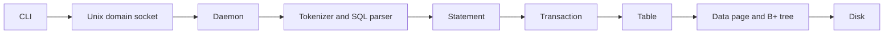
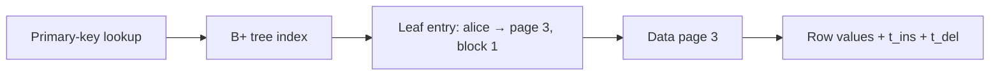
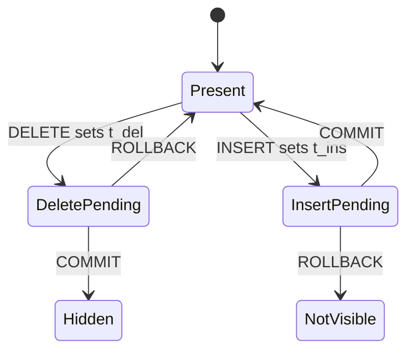

I built ANDB, a relational database system in C++, from scratch.

I did not build it because I wanted to create the next PostgreSQL. I built it because I wanted to understand how databases actually work.

I had studied databases in college. I knew about tables, normalization, transactions, and ACID properties. I knew what a database was supposed to do, but I did not really know how it could provide all those guarantees.

That bothered me.

We use databases every day without thinking much about what happens underneath them. We send a SQL query and get a result back. We commit a transaction and expect the data to be safe. We create an index and expect reads to become faster.

But why do these things exist in the first place?

What problem does an index solve? Why can’t we keep everything in a file? What does it actually mean for data to be persisted? What happens when a transaction fails halfway through?

I like asking those questions about the systems I use. One of the best ways I know to improve at software engineering is to stop using an abstraction for a moment and try to build it yourself.

ANDB was my attempt to do that.

## Starting with a file

The first version of ANDB was very simple.

A table was a file. When I wanted to insert a row, I converted the values into a string and appended them to the file. A row containing a name, email, phone number, and address could simply become a line in that file.

To find a row, I started at the beginning and scanned through the records until I found what I was looking for.

It worked.

Then I started asking what would happen when the table became larger.

A lookup meant checking records one by one. The more data I had, the more records I had to scan.

Deletion had another problem. Removing something from the middle of a file does not make the space disappear. I could leave the gap there and try to reuse it later, or rewrite the remaining data to close it.

That was my first important lesson from the project:

> Writing data to a file is easy. Managing that data efficiently is a different problem.

That pushed me to learn how databases organize data on disk.

## Learning about pages and indexes

One of the first concepts I came across was the idea of a page.

A database does not normally think of disk storage as individual rows or bytes. It works with fixed-size chunks of data. If the data I need lives inside a page, the database reads that page and works with the data from there.

That changed how I thought about storage.

If data is already grouped into chunks, the next question is how to arrange those chunks so that we can find what we need without scanning everything.

That led me to indexes.

A sequential file has no useful structure for searching. If I have a thousand records and want one of them, I may need to check all thousand.

A tree changes that. I already knew how a binary search tree could reduce the search space by comparing a value and choosing one side of the tree. B+ trees take that idea further for storage systems: each node can hold many values, the values stay ordered, and the tree stays balanced.

ANDB uses a B+ tree whose nodes are stored on disk in fixed-size pages. The page size is 4,000 bytes. The tree stores keys and references to the physical location of rows rather than storing the full rows inside the index. Its leaf nodes are linked so that the tree can support range scans.

This was where the project became much more interesting.

## The B+ tree was not as simple as the textbook

Most examples I found described B+ tree nodes using a fixed number of keys.

ANDB could not work that way.

The page had a fixed size, but the keys could have different lengths. Ten short keys and ten long keys do not take the same amount of space.

So instead of saying that a node can hold a fixed number of records, ANDB had to track the size of a node in bytes. Once a node exceeded 4,000 bytes, it had to be split.

A split was not just a matter of moving half the keys somewhere else. The new page had to be created, the parent had to be updated, child pointers had to stay correct, and leaf sibling pointers had to be updated. If the parent became too large, the split had to move upward through the tree. A root split could change the structure of the tree itself.

That was one of the hardest parts of the project because the tree existed in two forms at once:

- the logical tree in memory
- the physical representation of that tree on disk

Every change had to keep both consistent. That was a much deeper problem than simply understanding the B+ tree algorithm.

## Then I needed a way to use it

At first, I tested ANDB through functions inside the C++ code. That was useful while building the storage layer, but I wanted a user-facing interface.

SQL was the obvious choice.

A lot of people who work with databases already know SQL, so instead of exposing internal functions, I could let users write commands such as:

```sql
CREATE TABLE users (...);
INSERT INTO users VALUES (...);
SELECT * FROM users;
UPDATE users SET ...;
DELETE FROM users WHERE ...;
BEGIN;
COMMIT;
ROLLBACK;
```

ANDB’s parser turns SQL into statements that the database can execute. It uses a tokenizer and a recursive-descent parser.

This part was not especially difficult for me because I had already built GoJS, a small programming language that taught me about tokenization, parsers, and abstract syntax trees.

The harder problem was connecting the SQL layer to everything underneath it.

## What actually happens when you run `INSERT`?

One thing I wanted to understand was what happens between typing a SQL query and changing a row on disk.

The architecture became fairly clear:



The CLI sends the query to a background daemon through a Unix domain socket. The daemon creates a thread for the client and passes the query to the interpreter. From there it goes through tokenization, parsing, statement execution, the transaction layer, the table layer, page storage, and finally the B+ tree.

Suppose I run:

```sql
INSERT INTO users VALUES ("alice", 25);
```

The CLI does not understand the SQL. It sends the raw command to the daemon.

The daemon’s interpreter tokenizes it and creates an `InsertStatement`.

If the query is not part of an explicit transaction, ANDB creates a transaction for that statement and commits it automatically. If I use `BEGIN`, multiple statements can share the same transaction.

The transaction gets an ID, and that ID becomes part of the storage system.

The table checks the values, checks the primary key, serializes the row, and asks the storage layer to place it into a 4,000-byte page. The stored row gets an insert transaction ID, `t_ins`, and a delete transaction ID, `t_del`.

The storage layer returns a location such as:

```text
alice → page 3, block 1
```

The B+ tree stores that reference. The actual row stays in the data file.



This helped me understand something I had never really thought about: an index does not have to contain the data itself. It can contain a way to find the data.

## Transactions changed how I thought about databases

I knew about transactions before ANDB. I knew that I could start a transaction, perform several operations, and then commit or roll it back.

Implementing them made the idea much more concrete.

The biggest realization was that a transaction is not just a wrapper around several SQL statements. It affects the interpreter, storage, row format, indexes, visibility rules, transaction state, and recovery.

The interesting problem was that writes could happen before the transaction committed.

Suppose a transaction deletes a row. If I physically remove the row and its B+ tree entry immediately, what happens if the transaction later rolls back? I would have to recreate the row, restore its original location, restore its index entry, and possibly repair parts of the tree.

Instead, ANDB separates logical deletion from physical deletion.

When a transaction deletes a row, the row stays in place. The deleting transaction ID is stored in `t_del`, and the index entry also remains. Readers then decide whether the row should be visible based on the state of that transaction.



The same idea works for inserts.

This was one of the most useful things I learned from the project:

> Rollback does not always have to mean reversing every physical write.

You can also keep the physical data and use transaction metadata to decide what readers are allowed to see.

That approach simplified some parts of transaction handling, but it created another problem: the data was still physically there. Deleted rows still occupied space, old index entries could remain, and cleaning that data up became a separate problem.

## The part where I learned my limits

ANDB was a learning project, not a production database. Looking back at the implementation makes the missing pieces clear.

The project contains a WAL and transaction logs, but it does not have complete crash recovery. Insert WAL logging is incomplete, and the database does not replay the WAL when it starts again.

There are also places where the storage model is much simpler than a production system. There is no real buffer pool, so pages are read from disk as needed instead of being managed through a dedicated cache. The B+ tree is disk-backed rather than being loaded entirely into memory.

Space reclamation is another unfinished problem. Logical deletion helped with transactions, but the physical space still needs to be reclaimed later.

There are also parts of the B+ tree deletion path that I did not finish. Insert splitting was the main structural challenge, while physical index deletion and complete underflow handling remained incomplete.

I am glad I can see those limitations now. A project like this teaches you as much from what did not work as from what did.

## What surprised me most

The biggest surprise was how quickly one simple problem led to another.

I started with:

> I just need to store some rows.

Then I needed better searching. That led to indexes. Indexes led to B+ trees. B+ trees led to pages. Pages led to disk layout.

Transactions led to transaction IDs and visibility. Visibility led to questions about rollback. Rollback led to questions about physical cleanup. Then durability raised another set of problems around flushing, logging, and recovery.

Each layer solved one problem and exposed another one underneath it.

That is probably the biggest thing ANDB changed for me.

Before building it, I mostly saw a database as an abstraction that accepted SQL and returned data. After building it, I started seeing the layers underneath that abstraction.

A query is text until a parser gives it meaning.

A row is data until the storage engine decides how to place it on a page.

An index is not just a feature that makes reads faster. It is a data structure that has to exist somewhere and stay consistent with the rows it points to.

A transaction is not just `BEGIN` and `COMMIT`. It is a system for deciding what changes are visible, what happens when something fails, and what the database can promise after a commit.

## What I would build differently today

If I started ANDB again, I would spend more time on the storage engine before adding more database features.

I would build a proper page cache or buffer pool. I would make the recovery system complete instead of leaving a partially implemented WAL. I would finish physical space reclamation and make transaction state safe for concurrent clients.

I would also spend more time testing failure cases.

The project taught me that the difficult part of systems programming is often not making the happy path work. It is deciding what happens when the system is interrupted halfway through.

## Why I still like this project

ANDB was never meant to compete with PostgreSQL or MySQL. That was not the point.

The point was to take something I normally use as a black box and open it up.

I built a database because I wanted to understand databases. I ended up learning about much more than SQL: how storage layout affects data structures, how indexes connect logical data to physical locations, how transactions affect the whole storage system, and how many guarantees we take for granted depend on careful work underneath the interface.

The project started with a file.

It ended with a much better understanding of why a database needs so much more than a file.

And that was exactly what I wanted from it.
