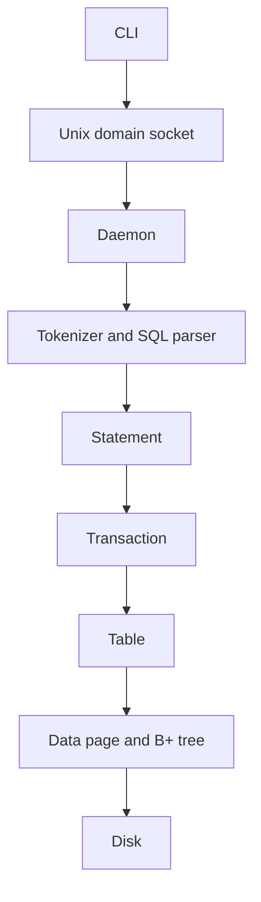
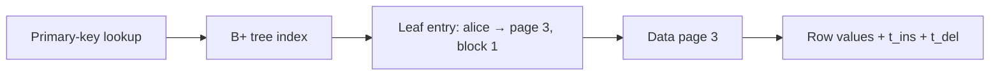
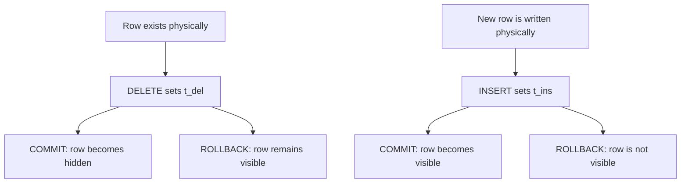

I built ANDB, a relational database system in C++, from scratch.

I did not build it because I wanted to create the next PostgreSQL. I built it because I wanted to understand how databases actually work. I had studied tables, normalization, transactions, and ACID properties in college, but I did not really know how a database could provide all those guarantees.

We use databases every day without thinking much about what happens underneath. We send a SQL query and get a result. We commit a transaction and expect the data to be safe. We create an index and expect reads to become faster.

But why do these things exist? What problem does an index solve? Why can’t we keep everything in a file? What does it mean for data to be persisted, and what happens when a transaction fails halfway through?

I like asking those questions about the systems I use. One of the best ways I know to improve at software engineering is to stop using an abstraction for a moment and try to build it yourself. ANDB was my attempt to do that.

## Starting with a file

The first version of ANDB was very simple. A table was a file. When I inserted a row, I converted the values into a string and appended them. A row containing a name, email, phone number, and address could simply become a line in that file.

To find a row, I scanned from the beginning until I found what I was looking for. It worked, but a lookup meant checking records one by one. Deletion had another problem: removing something from the middle of a file does not make the space disappear. I could leave the gap and reuse it later, or rewrite the remaining data to close it.

That was my first important lesson:

> Writing data to a file is easy. Managing that data efficiently is a different problem.

That pushed me to learn how databases organize data on disk.

## Learning about pages and indexes

A database does not normally think of disk storage as individual rows or bytes. It works with fixed-size chunks called pages. If the data I need lives inside a page, the database reads that page and works with the data from there.

Once data is grouped into pages, we need a way to find the right page without scanning everything. A sequential file has no useful search structure, so finding one record among a thousand may require checking all thousand.

That led me to B+ trees. A binary search tree reduces the search space by comparing a value and choosing one side. A B+ tree takes that idea further for storage systems: each node can hold many ordered values, the tree stays balanced, and the leaf nodes can be linked for range scans.

ANDB stores its B+ tree nodes on disk in fixed-size pages. The page size is 4,000 bytes. The index stores keys and references to the physical locations of rows rather than storing the full rows itself.

## The B+ tree was not as simple as the textbook

Most examples describe B+ tree nodes using a fixed number of keys. ANDB could not work that way because keys can have different lengths. Ten short keys and ten long keys do not take the same amount of space.

ANDB therefore tracks node size in bytes. When a node exceeds 4,000 bytes, it has to split. That means creating a new page, updating the parent, keeping child pointers correct, and updating leaf sibling pointers. If the parent becomes too large, the split moves upward. A root split can change the structure of the tree itself.

This was difficult because the tree existed in two forms at once:

- the logical tree in memory
- the physical representation of that tree on disk

Every change had to keep both consistent. That was much deeper than simply understanding the B+ tree algorithm.

## Then I needed a way to use it

At first, I tested ANDB through C++ functions. That helped while building the storage layer, but I wanted a user-facing interface, so SQL was the obvious choice:

```sql
CREATE TABLE users (...);
INSERT INTO users VALUES (...);
SELECT * FROM users;
UPDATE users SET ...;
DELETE FROM users WHERE ...;
BEGIN;
COMMIT;
ROLLBACK;
```

ANDB’s parser uses a tokenizer and a recursive-descent parser to turn SQL into executable statements. This part was familiar because I had already built GoJS, a small programming language that taught me about tokenization, parsers, and abstract syntax trees. The harder problem was connecting the SQL layer to everything underneath it.

## What actually happens when you run `INSERT`?

The architecture became fairly clear:



The CLI sends the raw query to a background daemon through a Unix domain socket. The daemon creates a thread for the client and passes the query to the interpreter. From there it goes through tokenization, parsing, statement execution, the transaction layer, the table layer, page storage, and finally the B+ tree.

Suppose I run:

```sql
INSERT INTO users VALUES ("alice", 25);
```

The interpreter tokenizes the query and creates an `InsertStatement`. If it is not part of an explicit transaction, ANDB creates a transaction for the statement and commits it automatically. If I use `BEGIN`, multiple statements can share one transaction.

The transaction gets an ID. The table checks the values and primary key, serializes the row, and asks the storage layer to place it into a 4,000-byte page. The row gets an insert transaction ID, `t_ins`, and a delete transaction ID, `t_del`. The storage layer might return:

```text
alice → page 3, block 1
```

The B+ tree stores that reference while the actual row stays in the data file:



This helped me understand that an index does not have to contain the data itself. It can contain a way to find the data.

## Transactions changed how I thought about databases

I knew that a transaction could group several operations and then commit or roll back. Implementing one showed me that it is much more than a wrapper around SQL statements. It affects the interpreter, storage, row format, indexes, visibility rules, transaction state, and recovery.

The difficult part was that writes could happen before a transaction committed. If a delete physically removed a row and its B+ tree entry immediately, a rollback would have to recreate the row, restore its location and index entry, and possibly repair the tree.

Instead, ANDB separates logical deletion from physical deletion. A deleted row stays in place. The deleting transaction ID is stored in `t_del`, and the index entry remains. Readers decide whether the row is visible based on the transaction state.



The same idea works for inserts. Rollback does not always have to reverse every physical write. Transaction metadata can decide what readers are allowed to see. The tradeoff is that deleted rows still occupy space and old index entries can remain, so cleanup becomes a separate problem.

## The part where I learned my limits

ANDB is a learning project, not a production database. It contains a WAL and transaction logs, but it does not have complete crash recovery. Insert WAL logging is incomplete, and the database does not replay the WAL when it starts again.

The storage model is also simpler than a production system. There is no real buffer pool, so pages are read from disk as needed. The B+ tree is disk-backed rather than loaded entirely into memory. Space reclamation is unfinished, and parts of B+ tree deletion, including physical index deletion and complete underflow handling, are incomplete.

I am glad I can see those limitations now. A project like this teaches you as much from what did not work as from what did.

## What surprised me most

The biggest surprise was how quickly one simple problem led to another. I started with, “I just need to store some rows.” Then I needed better searching. That led to indexes, B+ trees, pages, and disk layout.

Transactions led to transaction IDs and visibility. Visibility led to rollback. Rollback led to physical cleanup. Durability raised another set of problems around flushing, logging, and recovery.

Each layer solved one problem and exposed another one underneath it. Before building ANDB, I mostly saw a database as an abstraction that accepted SQL and returned data. After building it, I started seeing the layers underneath:

- A query is text until a parser gives it meaning.
- A row is data until the storage engine decides how to place it on a page.
- An index is a data structure that must stay consistent with the rows it points to.
- A transaction decides what changes are visible and what the database can promise after a commit.

## What I would build differently today

If I started ANDB again, I would spend more time on the storage engine before adding more database features. I would build a proper page cache or buffer pool, complete the recovery system instead of leaving a partially implemented WAL, finish physical space reclamation, and make transaction state safe for concurrent clients.

I would also spend more time testing failure cases. The difficult part of systems programming is often not making the happy path work. It is deciding what happens when the system is interrupted halfway through.

## Why I still like this project

ANDB was never meant to compete with PostgreSQL or MySQL. The point was to take something I normally use as a black box and open it up.

I built a database because I wanted to understand databases. I ended up learning how storage layout affects data structures, how indexes connect logical data to physical locations, how transactions affect the whole storage system, and how many guarantees we take for granted depend on careful work underneath the interface.

The project started with a file. It ended with a much better understanding of why a database needs so much more than a file, and that was exactly what I wanted from it.

If you want to understand the implementation in more detail, you can read the [ANDB technical deep dive](/blog/andb-technical-deep-dive/). It follows a query from the CLI through the parser, transaction layer, storage engine, B+ tree, and disk, while also documenting what the current implementation does and does not guarantee.
