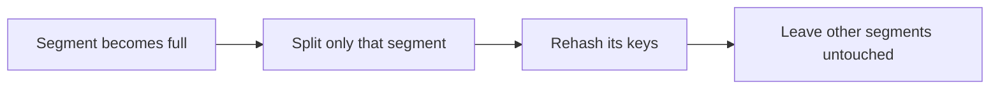
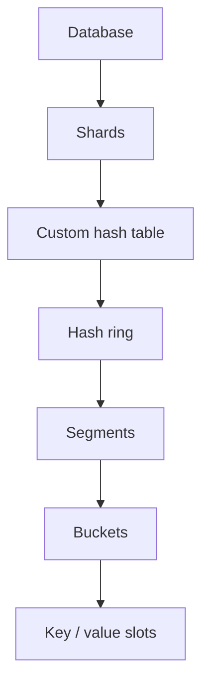
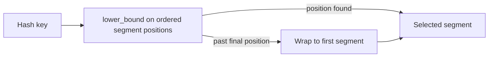
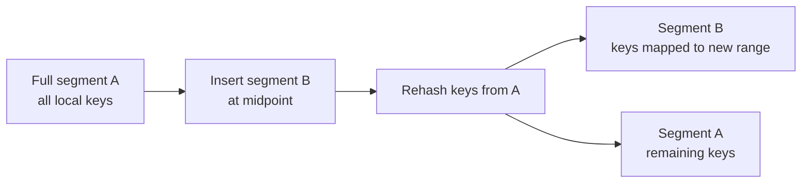
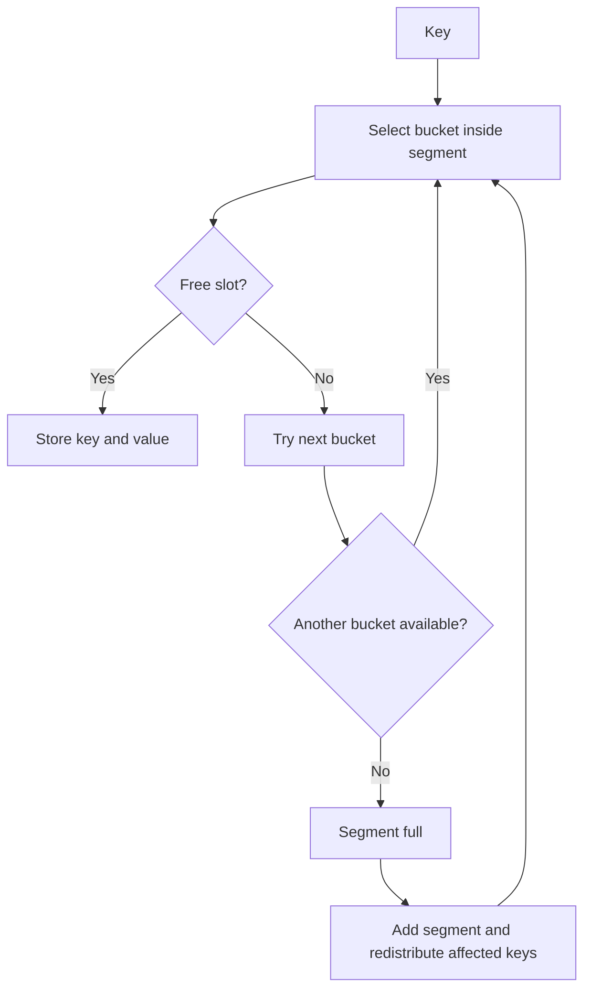
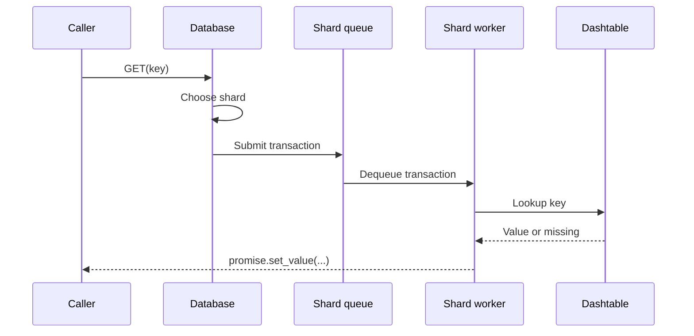
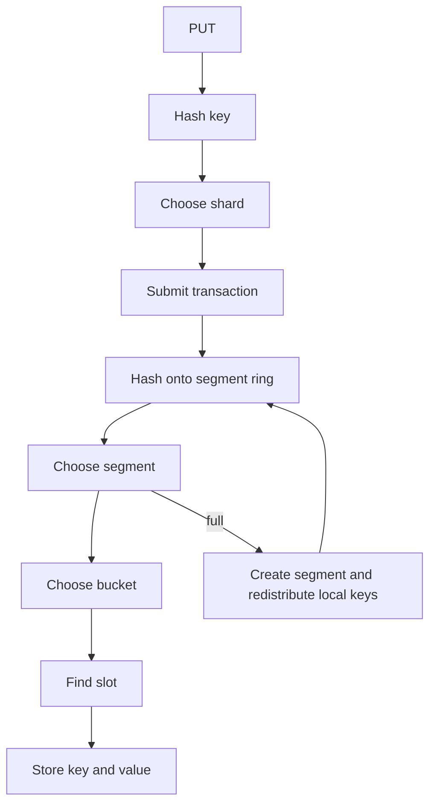

Redis has an incredibly simple interface.

```text
SET name anurag
GET name
```

From the outside, it looks like little more than a very fast map.

But I wanted to understand what happens underneath that interface.

How do you organize millions of keys? How do you make better use of multiple CPU cores? What happens when the underlying hash table becomes full? And can you grow that hash table without periodically rehashing a huge portion of the database?

Those questions led me to build **Better Redis**, an in-memory key-value database written from scratch in C++.

The project is built around two main ideas:

1. **Partition the keyspace across shards so operations can be processed concurrently.**
2. **Avoid expensive global hash-table resizing by splitting and rehashing only the region that becomes full.**

The goal was not to recreate Redis feature-for-feature. Better Redis does not implement persistence, replication, Pub/Sub, Redis data types, or the complete Redis protocol.

I wanted to focus on the part I found most interesting: the storage engine and the architecture underneath `GET`, `PUT`, and `DELETE`.

## The inspiration: DragonflyDB

Better Redis was heavily inspired by **DragonflyDB**, particularly its multithreaded architecture and custom **DashTable** design.

I first came across some of these ideas through Arpit Bhayani's videos on DragonflyDB internals. They made me dig deeper into how Dragonfly approaches storage and concurrency.

What interested me most was that Dragonfly was not simply trying to make a traditional Redis-like architecture faster. It reconsidered some underlying design decisions, including how work is distributed across CPU cores and how its hash table grows.

I wanted to understand those ideas properly. For me, the best way to understand a system is to try building a simplified version of it myself.

## Why build it?

The first idea I wanted to explore was **parallelism**.

A single large shared data structure can easily become a point of contention. If many operations need to synchronize around the same structure, adding more CPU cores does not necessarily mean proportionally more work gets done.

Instead, Better Redis divides the keyspace into **shards**. For every key, the database calculates a hash and determines which shard owns it:

```cpp
size_t hashValue = hash<string>{}(key);
int shardIndex = hashValue % numberOfShards;
```

Conceptually:

```text
user:100     → Shard 1
session:42   → Shard 4
order:9001   → Shard 7
```

Different shards can process work independently. This gives the system an opportunity to use multiple CPU cores rather than forcing every operation through one shared execution path.

The second idea was even more interesting: **rehashing**.

A traditional hash table has a limited capacity. Once it becomes too full, it usually needs to grow:

```text
Hash table becomes full
          ↓
Allocate a larger table
          ↓
Recalculate positions
          ↓
Move existing entries
```

For a small data structure, this is perfectly reasonable. But when a table contains a very large number of keys, resizing can require touching and relocating a large amount of data at once.

I wanted to experiment with a more incremental approach. Instead of resizing one giant table, Better Redis divides storage into smaller **segments**. When one segment becomes full, only that region is split and its keys are redistributed.



That became the central idea behind the project.

## The architecture

At a high level, Better Redis looks like this:



Each layer has one fairly small responsibility.

The **Database** determines which shard should receive a key. Each **Shard** processes operations against its own storage. Inside each shard is a custom hash table called `Dashtable`.

The Dashtable manages multiple **segments**, and each segment contains multiple **buckets**. At the bottom are the actual key-value slots.

Separating the system this way made each individual part easier to reason about.

## Building the hash table

At the lowest level, the storage format is intentionally simple. A bucket contains a fixed number of key-value slots, essentially:

```cpp
pair<string, string>
```

A `PUT` finds an available slot. A `GET` searches for the requested key. A `DELETE` clears the corresponding slot.

But the interesting problem is not storing the value. It is deciding which small portion of the table should contain the key.

For that, Better Redis uses a **hash ring**.

## Mapping keys onto a hash ring

Imagine the complete hash space as a circular range. Each segment owns a region of that space, represented by a position on the ring.

When a key arrives, the database hashes it into the same range. The table then finds the first segment positioned at or after that key's hash. Internally, I use `lower_bound` over the ordered segment positions to locate the appropriate segment. If the hash falls beyond the last segment, the lookup wraps back to the first one.



This gives the structure an important property: different portions of the hash space can grow independently.

## Splitting only the full segment

Suppose a segment currently owns a large portion of the hash space. Eventually its buckets become full.

Instead of increasing the size of the entire hash table, Better Redis inserts a new segment roughly halfway through the hash range handled by the full segment.

The values from the full segment are removed and inserted again. Because the ring now contains another segment, some keys remain in the original segment while others move into the new one.



The exact distribution depends on the hashes. But the key point is what does **not** happen: the rest of the table is untouched.

As more areas become full, they can split independently. Growth happens incrementally instead of requiring one global resize.

## Buckets and collisions

Once Better Redis has selected a segment, it hashes the key again to determine which bucket inside that segment should contain it.

Each bucket contains a fixed number of slots. If the selected bucket is full, the implementation attempts the next bucket. If that bucket also cannot accept the value, the segment is considered full.



That failure moves upward through the storage hierarchy:

```text
Bucket full
    ↓
Try overflow bucket
    ↓
Segment full
    ↓
Add another segment
    ↓
Redistribute affected keys
    ↓
Retry PUT
```

I liked this structure because resizing does not need to be understood by every layer. Buckets understand slots. Segments understand buckets. The Dashtable understands segments. The Database understands shards.

## Making it multithreaded

The other major part of Better Redis is its execution model.

Operations are represented as transactions:

```text
PUT key value
GET key
DELETE key
```

The database first determines which shard owns the requested key. Operations are then submitted to shard workers through a concurrent queue. The project uses C++ `promise` and `future` objects to communicate results back to the caller.

A read roughly follows this path:



Concurrency is not only about putting locks around shared memory. Sometimes the better approach is to reduce how much memory needs to be shared in the first place.

By partitioning the keyspace into shards, independent keys can be routed to independent pieces of the system. That gives the architecture an opportunity to take advantage of multiple CPU cores while reducing contention between unrelated operations.

The current project is still a prototype. One thing I would improve today is making queue ownership even stricter so each shard completely owns its own execution path. Implementing this version helped me understand why data ownership is such an important part of designing concurrent systems.

## Following a PUT through Better Redis

With everything combined, a simple operation like:

```cpp
db.Put("anurag", "raut");
```

passes through several layers:



If the selected segment is full, the new segment is created, local keys are redistributed, and the `PUT` is retried. All of that machinery exists underneath an API that, from the outside, looks incredibly simple.

That contrast is what made this project fun to build.

## Testing Better Redis

I used **GoogleTest** for testing and integrated **Hiredis** so I could also run similar workloads against an actual Redis instance.

One of the tests inserts 1,000,000 key-value pairs into Better Redis and then retrieves values afterward.

I would not use those tests to claim that Better Redis is faster than Redis. Redis has years of production optimization behind it, and a fair performance comparison would require carefully controlled benchmarks.

The Redis tests were mainly useful as a reference while I experimented with the architecture. If I continue the project, I would like to benchmark:

- throughput across different shard counts;
- read and write latency;
- concurrent workloads;
- the cost of segment splitting; and
- how resizing latency changes as the dataset grows.

## What I learned

### Hash tables become system-design problems

In an algorithms class, a hash table is mostly about hashing and collision handling. In a database, you suddenly care about resizing behavior, memory ownership, latency spikes, concurrency, and how much existing data has to move whenever the structure changes.

### Sharding is not only for multiple servers

I used to associate sharding mainly with spreading data across machines. But it is also useful inside a single process. Partitioning a keyspace creates smaller units of ownership that can process work independently.

### Resizing does not have to be global

This was probably the most interesting lesson from the project. A table does not necessarily need one global capacity. By dividing the hash space into segments, capacity can be added exactly where pressure appears.

### Reading architecture is useful. Rebuilding it is better.

I could have watched videos about DragonflyDB and understood the high-level idea. But implementing a simplified version forced me to answer questions that are not obvious from an architecture diagram:

- How do you select a segment?
- How do you know where to insert a new one?
- Which keys need to move?
- How do operations get routed between threads?

Those details are where most of the learning happened.

### Simple APIs hide complicated systems

```text
SET foo bar
```

looks trivial. Underneath it can involve hashing, routing, worker threads, queues, collision handling, segment selection, memory allocation, resizing, and redistribution.

That is probably my biggest takeaway from Better Redis. Using a database teaches you how to call it. Building one teaches you why something complicated can expose such a simple interface.

## Closing thoughts

Better Redis is not intended to replace Redis. It is a systems project I built to explore multithreaded storage, sharding, custom hash-table design, incremental resizing, and concurrency in C++, heavily inspired by the architecture of DragonflyDB.

And for me, that was much more interesting than simply implementing `GET` and `SET`.

The complete source code is available at [github.com/Anurag-Raut/Better-Redis](https://github.com/Anurag-Raut/Better-Redis).
